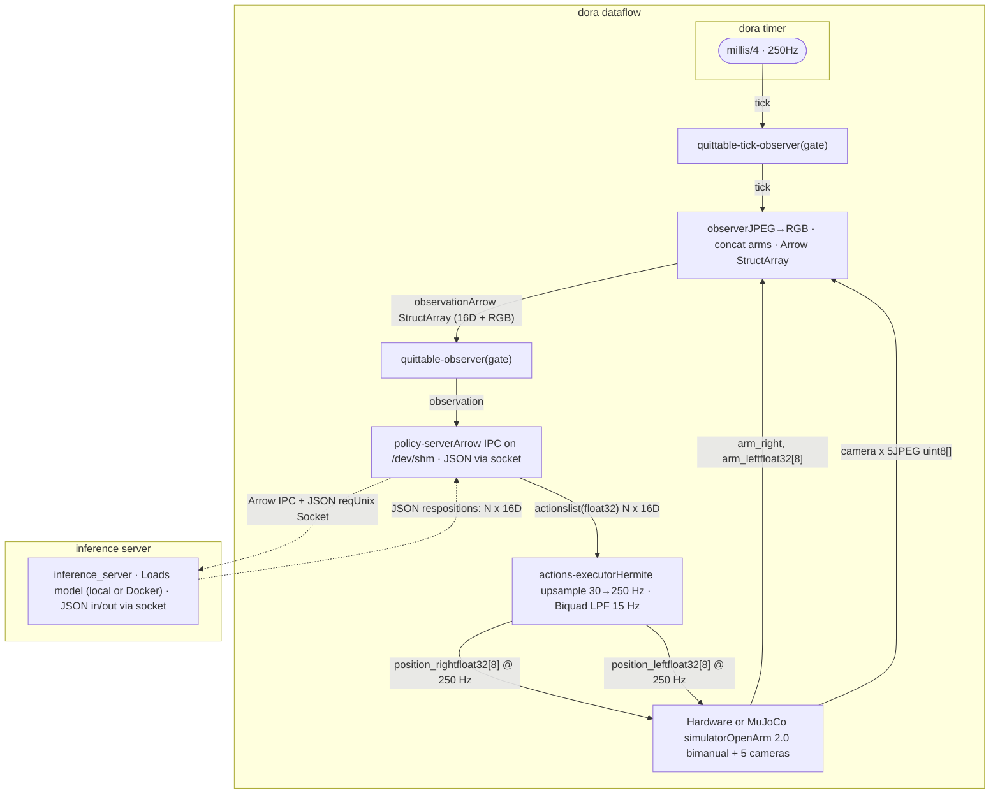

# docs.openarm.dev — OpenArm documentation (Enactic), snapshot of the Docusaurus source
# Source: https://github.com/enactic/openarm, branch main (pushed 2026-09-09), website/docs/ (2.0) and
# website/versioned_docs/version-1.0/ (files prefixed v1_). Captured 2026-09-13. The rendered site at
# https://docs.openarm.dev/ is a JavaScript app and returns no article text to curl, so the MDX sources are the
# faithful copy. JSX components, imports and inline style handlers are stripped; a few residual fragments remain.


<!-- ===== overview_index.mdx ===== -->
---
slug: /
title: Project Overview
sidebar_position: 1
---

# Project Overview

OpenArm is an open-source 7DOF humanoid arm designed for physical AI research and deployment in contact-rich environments. Hardware and software — CAD, firmware, control code, and simulation tools — are openly available so you can build, hack, and deploy.

We're in continuous development and actively seeking contributors, research partners, and company collaborators to shape the next generation of practical humanoid systems.

## Making SOTA Reproducible

OpenArm 2.0 is a unified environment for data collection and reproducible auto-evaluation — the open-source foundation to turn isolated experiments into shared progress. Claims like "Model A outperforms Model B" only hold meaning when results can be reproduced under identical conditions, so the project pairs the arm itself with a standardized evaluation environment and teaching tools.

## What's Unique?

- Human-scale design, with proportions and dimensions scaled for a person around 160–165 cm tall. This provides a good balance between practical reach and manageable inertia for safe, responsive operation.
- Safety-first architecture. QDD backdrivable motors and high compliance prioritize safe human–robot interaction while maintaining practical payload (6.0 kg peak / 4.1 kg nominal) for real-world tasks.
- Bilateral force feedback for contact-rich teleoperation and high-fidelity data collection, beyond what unilateral leader–follower setups can capture.
- Built for durability. Critical structural components use aluminum and stainless steel construction for robust performance under repetitive data collection and continuous research use.
- Fully accessible and buildable. Every component — from CNC parts and 3D-printed casings to electrical wiring — is purchasable and buildable by individual researchers and labs, with complete fabrication data provided.
- Practical and affordable. OpenArm delivers research-grade capabilities at a fraction of traditional humanoid robot costs, making advanced robotics accessible to more teams and applications.

## The OpenArm Ecosystem

OpenArm 2.0 is more than the arm. It is a coordinated set of hardware that targets the full loop of data collection, training, and reproducible evaluation.

- [OpenArm 2.0](../hardware/openarm-2.0/general.mdx) — the 7DOF arm itself: human-scale dimensions, QDD backdrivable joints, an in-hand camera in a redesigned compact gripper, and a MISUMI-frame base that is easy to mount and extend.
- [OpenArm Cell](../hardware/openarm-cell/general.mdx) — a reproducible evaluation cell that standardizes background, lighting, cameras, and arm position so that model comparisons are fair and automatable.
- [OpenArm KER](../hardware/openarm-ker/general.mdx) — Kinematic Equivalent Replica, a motorless leader arm with identical kinematics to OpenArm 2.0 for intuitive, low-fatigue teleoperation and teaching.

## Specifications at a Glance

OpenArm 2.0 has a small human-like physique. The support pillars are made of MISUMI aluminum frames, making it easy to adjust the dimensions and attach cameras, sensors, and other attachments. The base plate has evenly spaced M6 taps so it can be fixed directly to a table or other surface, and each joint has a mechanical limit that restricts the range of motion for safety.

    DOF7 per arm
    Nominal payload4.1 kg (held for 1 minute in the worst posture)
    Peak payload6.0 kg (3 s move + 1 s hold in the worst posture)
    JointsQDD backdrivable, mechanical limits on every axis
    Control busCAN-FD
    StructureAluminum + stainless steel, MISUMI-frame base
    End-effectorCompact parallel gripper with in-hand camera

See [Hardware → OpenArm 2.0 → General](../hardware/openarm-2.0/general.mdx) for full dimensions, payload definitions, and CAD/BOM downloads.

## Purchase OpenArm

OpenArm is available as a DIY kit or as a fully assembled unit from verified manufacturers worldwide.

   {

  }}

  }}
  >Buy Now →

## Project and Repositories

OpenArm is organized across multiple platforms to support different aspects of development, collaboration, and community engagement.

- Main site: [openarm.dev](https://openarm.dev) — project homepage with announcements, visualizations, and contact forms.
- Documentation: [docs.openarm.dev](https://docs.openarm.dev) — complete technical guides and tutorials.
- GitHub: [enactic/openarm](https://github.com/enactic/openarm) — open-source repositories, issue tracking, and feature requests.
- Discord: [Join the community](https://discord.gg/GmYa262ETH) — real-time discussions, support, and collaboration.

## Get Help

Our community and team are ready to help:

- Discord — connect with other builders, researchers, and the OpenArm team for real-time support and discussions: [Join Now](https://discord.gg/GmYa262ETH)
- GitHub Issues — report bugs or request features directly in our repository: [Open an Issue](https://github.com/enactic/openarm/issues)
- GitHub Discussions — ask technical questions in our repository: [Start a Discussion](https://github.com/enactic/openarm/discussions)


<!-- ===== overview_whats-new-in-2.0.mdx ===== -->
---
title: What's New in 2.0
sidebar_position: 2
---

# What's New in 2.0

OpenArm 2.0 is the second major release of the project. Beyond a refreshed arm, it expands OpenArm from "an open-source robot arm" into a full stack for reproducible physical-AI research: the arm, a standardized evaluation cell, and a passive teaching device, all designed to work together.

This page summarizes what changed since 1.0 and why.

## At a Glance

| Area | 1.0 | 2.0 |
|---|---|---|
| Hardware lineup | OpenArm (arm only) | OpenArm 2.0 arm + [OpenArm Cell](../hardware/openarm-cell/general.mdx) + [OpenArm KER](../hardware/openarm-ker/general.mdx) (not yet released) |
| Gripper | Linkage-driven parallel gripper, no in-hand camera | Compact gripper with an in-hand camera and replaceable fingers |
| Evaluation | Ad-hoc, per-lab setups | Reproducible cell with standardized lighting, cameras, calibration |
| Teaching / leader device | Leader-follower with a powered arm | Optional motorless [KER](../hardware/openarm-ker/general.mdx) leader for low-fatigue, long-session teleop |

## Hardware: OpenArm 2.0 Arm

The arm keeps the human-scale form factor and payload envelope of 1.0 (7DOF, 4.1 kg nominal / 6.0 kg peak, MISUMI-frame base), and refines the parts that matter most for data collection in tight spaces.

- Redesigned end-effector. The gripper uses a simpler actuation mechanism to keep the overall envelope compact, making it easier to reach into confined spaces than the 1.0 gripper.
- In-hand camera. A camera is integrated inside the gripper case, so in-hand vision is captured directly during grasping. The finger geometry is shaped both for stable grasping and to minimize blind spots in that view.
- Replaceable fingers. The finger components are easy to swap, so users can iterate on geometries for specific tasks or objects without redesigning the gripper itself.

See [Hardware → OpenArm 2.0](../hardware/openarm-2.0/general.mdx) for full dimensions, payload definitions, motor specifications, and the CAD/BOM drive link.

## New: OpenArm Cell

[OpenArm Cell](../hardware/openarm-cell/general.mdx) is a new piece of hardware introduced in 2.0. It is a standardized evaluation enclosure that fixes the things that usually drift between labs — background, lighting, cameras, and the arm's mounted position — so that benchmark numbers can actually be compared.

Highlights:

- Off-the-shelf MISUMI-based enclosure and power system for maintainability and global availability of parts.
- Vertically adjustable Z-axis to accommodate different workpiece heights.
- Area-sensor reach-in stop that cuts power on intrusion into the workspace.
- Dedicated zero-position calibration jig that mechanically constrains the gripper to its CAD-defined angles, eliminating assembly tolerances from the dataset.

The motivation is simple: "Model A outperforms Model B" only carries meaning when both were evaluated under the same conditions. The Cell is the shared substrate that makes that possible.

## New: OpenArm KER

[OpenArm KER](../hardware/openarm-ker/general.mdx) (Kinematic Equivalent Replica) is a motorless leader arm whose kinematics match OpenArm 2.0 exactly. With zero actuators, it is lightweight enough to wear or mount near the operator and avoids the fatigue of moving a powered leader for long teleoperation sessions.

KER is targeted at extended data-collection workflows where the operator needs to drive the follower for hours.

:::note

KER is part of the OpenArm 2.0 lineup but has not been released yet. The design is being finalized, and full CAD and BOM will be published once it is ready.

:::

## Documentation and Workflow

The documentation was reorganized around the 2.0 product lineup:

- Hardware is split per product (OpenArm 2.0, OpenArm Cell, OpenArm KER) instead of a single "Specifications" section.
- A dedicated Dataset section was added for data-collection workflows that feed the Cell-based evaluation loop.
- The Overview category was simplified: the previous "Discover OpenArm" and "Project Overview" pages are merged into a single [Project Overview](./index.mdx), and this page was added.

## Continuity from 1.0

Some things deliberately did not change:

- 7DOF human-scale arm with a MISUMI-frame base.
- Same motor lineup (DM-J4310-2EC, DM4340, DM-J8009P) as 1.0.
- Same payload envelope: 4.1 kg nominal / 6.0 kg peak, including the end-effector.
- Open hardware and software, buildable from public CAD, BOM, and code.

If you are still on 1.0, the [1.0 documentation](https://docs.openarm.dev/1.0/) remains available.


<!-- ===== purchase_index.mdx ===== -->
---
sidebar_position: 1
---

# Buying OpenArm

We’re making it easier, more reliable, and more transparent to purchase OpenArm hardware.

This page lists all known OpenArm manufacturers worldwide. Manufacturers labeled **official** or **certified** have been evaluated for their manufacturing quality and compatibility with the official OpenArm project.

---

## Official Manufacturing Partners

Official Manufacturing Partners and Certified Manufacturers work closely with the OpenArm team to refine and improve the manufacturing process, ensuring each unit meets our high hardware quality standards. The OpenArm team maintains direct communication with these partners to uphold consistency, reliability, and ongoing development.

          >RT Corporation

          Tokyo, Japan
          ● Now accepting orders

          📦 Starting Price
          By quotation

          ⏱️ Lead Time (Order→Ship)
          Arranged after order

          🛠️ Includes
          Setup & testing, JP-spec AC adapter, optional 1-yr warranty

          🌏 Shipping Regions
          Primarily Japan

      From the Supplier:

        As Enactic's official supplier in Japan, RT Corporation delivers OpenArm with local, Japanese-language support, drawing on over 20 years of humanoid robot development. Units arrive set up and tested, with a Japan-spec AC adapter, plus an optional 1-year warranty and paid maintenance.

      Available configurations:

        OpenArm 2.0 Leader and Follower, OpenArm Cell, an upgrade kit, and end-effector (hand) options. Pricing and configuration are provided by quotation.

      How to order:

        A quote-based process: inquiry, configuration & quote, order, setup & testing, and delivery.

    >Get a Quote →

          >WowRobo

          ★★★
          Shenzhen, China

          OpenArm 2
          {'from $6,500'}

          OpenArm Cell
          {'from $6,200'}

          OpenArm KER
          {'from $2,599'}

          📦 Starting Price
          {'$5,400 (V1.1)'}
          {'$6,500 (V2)'}
          {'$6,200 (Cell)'}
          {'$2,599 (KER)'}
          {'$49 (KER Encoder Unit)'}

          ⏱️ Lead Time (Order→Ship)
          20-40 days

          💳 Payment Methods
          Bank Transfer, Shopify, PayPal

          🌏 Shipping Regions
          Worldwide via DHL/UPS/FedEx

      From the Manufacturer:

        At WowRobo, we bring commercial-grade reliability and manufacturing standards to open-source robotics. With extensive experience in commercial robot production, we handle the assembly and testing of OpenArm with the same rigor applied to industrial robots.

        As the official manufacturer of the SO-ARM101, we're proud to have refined our processes even further for OpenArm, achieving an even higher level of precision, reliability, and overall build quality. Our philosophy is simple: deliver the finest craftsmanship with minimal profit, and grow together with the OpenArm project and its global community.

      OpenArm 2.0:

        A V1 -> V2 upgrade kit is also available for existing OpenArm V1 owners.

      OpenArm Cell Modular Kit:

        A standardized workspace cell for reproducible embodied AI experiments. Includes a frame enclosure (1100 × 926 × 1883 mm), a 300 mm Z-axis, a top camera, and controlled lighting. Shipped in modular sections for easier international delivery.

      OpenArm KER (Kinematic Equivalent Replica):

        A motorless, shoulder-mounted leader arm for intuitive 1:1 teleoperation of OpenArm 2.0. Its 16 magnetic encoders (Infineon TLE5012B, 15-bit absolute) and bearing-equipped joints reduce operator load, while the joint structure and 70%-scaled link lengths enable high-precision motion mapping with no retargeting. The KER Encoder Unit is also available standalone for custom teleoperation inputs.

    >Buy Now →

:::info
## Community Reviews

Community feedback is essential for maintaining consistency and fairness in our evaluations.

- **Purchased an OpenArm before?**
Share your experience in our [**Discord**](https://discord.gg/GmYa262ETH) channel: **`#📦｜purchase`**
- **Missing Vendors?**
Notify us if any vendors are missing. Your input helps improve and expand the vendor list so everyone can buy OpenArm with confidence.

**Contact:** openarm@enactic.ai or DM us on Discord.
:::

---

## All Manufacturers

The list below includes vendors who produce OpenArm hardware but have **not yet completed** or **did not pass** our evaluation process. Their quality and compatibility may vary, and they are **not guaranteed** to work with official OpenArm software.

:::warning
Before purchasing, please consider:
- **Compatibility**: Verify that it meets OpenArm hardware and software standards.
- **Quality**: Ensure proper quality control.
- **Shipping**: Check for delivery costs and timelines, especially for international orders.
- **Returns & Warranty**: Verify the return, replacement, and warranty policies.
- **Reviews**: Read community feedback in the Discord **`#📦｜purchase`** channel.
:::

:::warning
**Notice any false or misleading claims?** Let us know at openarm@enactic.ai or via Discord.
:::

  | Company                                                    | Lead Time            | Shipping Region | Price* (USD)        | Quality ▼                                               | Notes                                                                                                                                                                                                                       |
  |------------------------------------------------------------|----------------------|-----------------|---------------------|---------------------------------------------------------|-----------------------------------------------------------------------------------------------------------------------------------------------------------------------------------------------------------------------------|
  | **WowRobo** (ShenZhen)                                     | 20-40 days           | Worldwide       | \$5,400 (V1.1) / \$6,500 (V2) / \$6,200 (Cell) / \$2,599 (KER) / \$49 (KER Encoder Unit) | Certified ★★★ | [**Accepting orders** (website)](https://shop.wowrobo.com/collections/openarm)V1.1, V2, V1 -> V2 upgrade kit, OpenArm Cell modular kit, [OpenArm KER](https://shop.wowrobo.com/products/openarm-ker), and [KER Encoder Unit](https://shop.wowrobo.com/products/ker-encoder-unit) available.Discord: `@Leo Xiao @WowRobo`Wechat: `xiaonian52`Email: `leo.xiao@wowrobo.com` |
  | **RT Corporation** (Tokyo)                                 | By quotation         | Japan           | By quotation        | Evaluating...                                           | [**Accepting orders** (website)](https://rt-net.jp/service/openarm/)OpenArm 2 (Leader/Follower), Cell, upgrade kit, and hand options available.Pricing & orders by quotation.Primarily serving customers in Japan. |
  | VLAI Robotics (ShenZhen)                                   | 3-12 days            | Worldwide       | $4,699              | Evaluating...                                           | [**Accepting bulk orders** (website)](https://vlai.cn/)WeChat: `VLAIBOT`Email: `zhang@vlai.cn` |
  | Cereboto (Dongguan)                                        | V2: 14-30 days / V1: 7-14 days / KER: 14-30 days | Worldwide | \$6,280 (V2 no camera) / \$7,080 (V2 with camera) / \$5,000 (V1) / \$1,000 (V1->V2 kit) / \$2,399 (KER) | Evaluating... | [**Accepting orders** (V2 website)](https://cereboto.com/product/openarm-2-robotic-arm-kit/) [(V1 website)](https://cereboto.com/product/openarm/) [(KER website)](https://cereboto.com/product/openarm-ker/) [(taobao)](https://item.taobao.com/item.htm?id=985310497224)V1, V2, V1->V2 upgrade kit, and OpenArm KER available.Discord: `@chuck.yu`WeChat: `U_Charles`Email: `chuck.yu@cereboto.com`   |
  | Soma Robotics (Shanghai)                                   | 14 days              | Mainland China  | $6,430 (CNY 45,800) | Not evaluated                                           | [**Accepting orders** (email)](mailto:sales@somarobotics.ai)WeChat: `CTYNSDB`                                                                                                                                                |
  | Anvil Robotics (Taipei)                                    | Ships within 48 hours | Worldwide      | $5,600 (V2)         | Not evaluated                                           | [**Accepting orders** (website)](https://shop.anvil.bot/collections/all)OpenArm 2.0 full devkits in stock, shipped within 48 hours. OpenArm 1.0 deprecated.Discord: `@mike[at]anvil.bot`                                  |
  | Chengdu Changshu Robotics Co., Ltd. (PowerZ)               | 7 - 28 days          | Worldwide       | $4,999              | Not evaluated                                           | [**Accepting orders** (website)](https://www.openarmx.com)Discord: `@PowerZ`WeChat: `alwaysklose`⚠️ "OpenArmX Pro Max" is **NOT** affiliated with or compatible with the official OpenArm project at the moment. |
  | Hangzhou Space Variable Technology Co., Ltd. (SVTRobotics) | 5 - 10 business days | Worldwide       | $5,800              | Not evaluated                                           | [**Accepting orders** (website)](https://svtrobot.com/)WeChat: `qtt123456`Email: `898363@gmail.com`Discord: `@svtrobot`                                                                                      |
  | Tianjin Muniu Liuma Technology Development Co., Ltd        | -                    | Worldwide       | $5,166              | Not evaluated                                           | Email: `xuqingdeng@tjnmt.com`                                                                                                                                                                                                  |
  | MJTWO                                                      | -                    | Worldwide       | \$4,999 - \$5,399   | Not evaluated                                           | [**Accepting orders** (website)](https://openarm.shop/)                                                                                                                                                                        |

*=standard price of 1 unit with follower end effectors

:::info
**Manufacturers:** To be listed or apply for certification, please reach out to openarm@enactic.ai
:::

**This page updates regularly as we certify vendors.**


<!-- ===== hardware_openarm-2.0_general.mdx ===== -->
---
title: General
sidebar_position: 1
---

```mdx-code-block

```

# General

## Key features

## Manufacturing Information

  📁 3DCAD and BOM

    3D CAD data required for manufacturing and customization,
    along with a bill of materials (BOM) containing purchasing information for each component.

  View Drive

## General Dimensions

OpenArm 2.0 has a small human-like physique.
The support pillars are made of MiSUMi aluminum frames, making it easy to adjust the dimensions and attach cameras, sensors, and other attachments.
The base plate has evenly spaced M6 taps, allowing it to be fixed directly to a table or other surface.
Each joint has a mechanical limit that restricts the range of motion for safety.

## Payload definition

### Nominal payload : 4.1kg

Nominal payload means the weight that could be held for one minute in the worst posture (arms extended to maximum).

### Peak payload : 6.0kg

Peak payload means the weight that could be moved from the arms down to the worst posture over a period of 3 seconds and held for 1 second before returning.

:::warning

Note that the payload contains the end effector. For example, if a 1.5 kg end-effector is attached to the OpenArm 2.0,
the nominal payload is 2.6 kg and the peak payload is 4.5 kg.

:::


<!-- ===== hardware_openarm-2.0_motor.mdx ===== -->
---
title: Motor
sidebar_position: 2
---

```mdx-code-block

```

# Motor

## Motor Location

OpenArm 2.0 uses the DAMIAO 43 series and DAMIAO 8009P motors.
To efficiently achieve high payload capacity, different motors are selected for each joint from the shoulder to the end-effector.
To ensure greater rigidity and precision, motors equipped with cross-roller bearings are used in sections supported on one side.
Although the DAMIAO 4340 series is not a QDD motor, it was chosen to balance high payload capacity with a clean, compact appearance.

## Detailed Specifications

| Parameter | **DM-J4310-2EC V1.1** | **DM4340 series** | **DM-J8009P-2EC** |
|---------------------------|----------------|----------------|----------------|
| **Datasheet** | [Datasheet of DM-J4310-2EC V1.1](https://damiao.enactic.ai/en/products/hardware/dm-j4310-2ec-v1.1) | [Datasheet of DM-J4340-2EC](https://damiao.enactic.ai/en/products/hardware/dm-j4310-2ec-v1.1), [Drawing of DM-J4340P-2EC](https://damiao.enactic.ai/en/products/hardware/dm-j4340p-2ec-v1.0) | [Datasheet of DM-J8009-2EC](https://damiao.enactic.ai/en/products/hardware/dm-j8009p-2ec-v1.0) |
| **Rated Voltage** | 24V | 24V | 24V (Supports 24–48V) |
| **Rated Current** | 2.5A | 2.5A | 20A |
| **Peak Current** | 7.5A | 8A | 50A |
| **Rated Torque** | 3 Nm | 9 Nm | 20 Nm |
| **Peak Torque** | 7 Nm | 27 Nm | 40 Nm |
| **Rated Speed** | 120 rpm | 36 rpm | 24V: 100 rpm / 48V: 200 rpm |
| **Max No-load Speed** | 200 rpm | 52 rpm | 24V: 160 rpm / 48V: 320 rpm |
| **Reduction Ratio** | 10:1 | 40:1 | 9:1 |
| **Number of Pole Pairs** | 14 | 14 | 21 |
| **Phase Inductance** | 340 μH | 317 μH | 61 μH (at 25°C) |
| **Phase Resistance** | 650 mΩ | 760 mΩ | 90 mΩ (at 25°C) |
| **Outer Diameter** | 56 mm | 57 mm | 98 mm |
| **Height** | 46 mm | 53.3 mm | 61.7 mm |
| **Motor Weight** | 300 g | 362 g | 896 g |
| **Encoder Bits** | 14-bit | 14-bit | 14-bit |
| **No. of Encoders** | 2 | 2 | 2 |
| **Encoder Type** | Magnetic encoder (single-turn) | Magnetic encoder (single-turn) | Magnetic encoder (single-turn) |
| **Control Interface** | CAN | CAN | CAN |

:::warning
📌 Note: While the linked datasheet is for the DM8009 model, the actual motor used in our arms is the DM8009P. The specifications of both models are nearly identical, and for all practical purposes, the DM8009 datasheet provides an accurate reference for evaluating the motor's performance and compatibility.
:::

:::info
For detailed specifications and resources on the motors used in this project, please visit [the official Damiao GitHub page](https://github.com/dmBots). It includes datasheets, communication protocols, and configuration tools for various models.
:::


<!-- ===== hardware_openarm-2.0_gripper.mdx ===== -->
---
title: Gripper
sidebar_position: 3
---

# Gripper

```mdx-code-block

```

## Key features

The OpenArm 2.0 end-effector is designed with a simple actuation mechanism to keep the overall size compact.
Compared with the previous version, this makes it easier to perform tasks in confined spaces, such as reaching into narrow areas.

A built-in camera is integrated inside the case, enabling direct acquisition of in-hand vision during grasping.
The finger geometry is designed not only to provide stable grasping performance, but also to minimize blind spots and maintain a clear field of view while handling objects.

The finger components are also designed to be easily replaceable, providing a flexible development platform where users can customize and improve the finger design for their specific tasks, or evaluate specialized geometries optimized for particular objects and applications.


<!-- ===== hardware_openarm-cell_general.mdx ===== -->
---
title: General
sidebar_position: 1
---

```mdx-code-block

```

# General

## Key features

OpenArm Cell is developed to provide a standardized benchmark for accurately comparing and evaluating the performance of robotic foundation models.
By defining not only the robot arm itself, but also all other elements that affect training and inference—including lighting, cameras, and calibration procedures—as part of a unified system, OpenArm Cell improves the reproducibility of model performance evaluation.

## Manufacturing Information

  📁 3DCAD and BOM

    3D CAD data required for manufacturing and customization,
    along with a bill of materials (BOM) containing purchasing information for each component.

  View Drive

## General Dimensions

OpenArm Cell incorporates the manufacturing concept of a "cell" into the design philosophy of OpenArm, using widely available off-the-shelf components from companies such as MISUMI to construct the enclosure and power system.
This approach provides a robust operating environment capable of withstanding repetitive task execution while maintaining excellent maintainability and component availability.

The system also features a vertically adjustable Z-axis, enabling flexible task execution that can adapt to different workpiece heights and layouts.

:::warning

Please ensure that the available electrical capacity and floor load capacity at the installation site are sufficient for the number of OpenArm Cell units to be deployed.
As a general reference, each OpenArm Cell weighs approximately 100 kg and consumes approximately 480 W, plus the power required by the installed PC.
Actual weight and power consumption may vary depending on the specific equipment configuration.

:::

:::warning

Please verify in advance that all access routes from the building entrance to the installation location—including door widths and heights, as well as elevator dimensions—provide adequate clearance for physical transport and installation.

:::

## Operational Support Features

### Reach-In Stop

OpenArm Cell is equipped with an intrusion detection system based on area sensors.
It detects unexpected entry into the workspace during operation and automatically shuts off power, helping to ensure the safe and reliable management of the experimental environment.

### Zero-Position Calibration Jig

OpenArm Cell also includes a high-precision dedicated calibration jig that secures the gripper in a fixed position and physically constrains all degrees of freedom to their ideal CAD-defined angles.
By eliminating unavoidable assembly errors and component tolerances through calibration, it ensures a consistent data foundation that is essential for operation in diverse environments around the world.


<!-- ===== hardware_openarm-ker_general.mdx ===== -->
---
title: General
sidebar_position: 1
---

```mdx-code-block

```

# General

## Key features

OpenArm KER (Kinematic Equivalent Replica) is a motorless leader arm designed to enable intuitive operation of OpenArm 2.0.
Its joints incorporate magnetic encoders and bearings, reducing operational resistance and helping to alleviate the physical load on the operator.

OpenArm KER adopts a joint structure that exactly matches OpenArm 2.0, together with link lengths scaled to 70%.
This enables high-precision 1:1 motion mapping without requiring any coordinate transformation or retargeting.

## Manufacturing Information

  📁 3DCAD and BOM

    3D CAD data required for manufacturing and customization,
    along with a bill of materials (BOM) containing purchasing information for each component.

  View Drive

## General Dimensions

OpenArm KER achieves a lightweight body of 1.7 kg by combining lightweight CFRP pipes, machined aluminum parts, and resin components.
Its shoulder-mounted backpack-style design allows smooth attachment within 30 seconds without assistance, while also fitting a wide range of body types.

The backpack section can be folded, making it possible to store and transport OpenArm KER in a standard travel case.


<!-- ===== hardware_openarm-ker_encoder-module.mdx ===== -->
---
title: Encoder Module
sidebar_position: 2
---

```mdx-code-block

```

# Encoder Module

## Key features

All axes of OpenArm KER use a common encoder module.
This advanced module design integrates a hardware limit, bearings, a magnetic encoder, and a driver, enabling the module to be applied to a wide range of systems.

## Daisy-Chain Communication

The encoder modules support daisy-chain connection with individually assigned IDs.
This allows even a 7+1 DoF robot arm controller to be configured as a simple system with minimal wiring.

## Custom Configurations

The encoder module integrates a magnetic encoder, bearings, a hardware limit, and a driver board into a compact body, while providing high mounting flexibility that allows it to be fixed from multiple directions.

By taking advantage of this flexibility and designing custom frames to connect multiple modules, it can also serve as a foundation for building custom input devices tailored to specific applications.


<!-- ===== teleop_leader-follower_index.mdx ===== -->
---
slug: /teleop/
---

# Leader-Follower Teleoperation

OpenArm supports 1:1 teleoperation from a **leader** arm to a **follower** arm in two control modes:

## Unilateral Control

This is the **basic teleoperation setup**, where the follower arm directly mimics the leader’s movements through position commands.
It’s a **one-way control** scheme — the leader sends motion commands, but no force feedback is returned.

- **Pros:** Simple and robust; ideal for initial tests and free-space motion
- **Cons:** No tactile feedback, making it easy to apply excessive force or lose alignment during contact tasks
- **Best for:** Basic teleoperation, open-space manipulation, fast and lightweight operations without contact forces

## Bilateral Control

Bilateral control enables **two-way force feedback** between the leader and follower arms, allowing the operator to feel what the follower arm touches.

For detailed setup and configuration, see the [Bilateral Control guide](/teleop/leader-follower/bilateral-control/).


<!-- ===== teleop_leader-follower_bilateral-control.md ===== -->
---
sidebar_position: 3
---

# Bilateral Force Feedback Control

This section describes how to run bilateral control using the provided scripts.

## 💡 Project Architecture Summary

The project uses a **multi-threaded structure**.

A custom class derived from `PeriodicTimerThread` is used to spawn and manage **three threads**:

- **Leader thread**: Handles control logic for the leader arm.
- **Follower thread**: Handles control logic for the follower arm.
- **Admin thread**: Manages coordination and communication between components.

Core control logic is encapsulated in the `Control` class, which supports both:

- **Bilateral control**: For force-feedback, master-slave style interaction.
- **Unilateral control**: For single-arm or open-loop operation without feedback.

## Control & Friction Parameters (per joint)

| Name | Meaning |
|------|---------|
| **Kp** | Position control gain |
| **Kd** | Velocity control gain |
| **Fc** | Static friction (Coulomb) level |
| **k**  | Sharpness of friction transition |
| **Fv** | Viscous friction (speed-based) |
| **Fo** | Friction offset (bias correction) |

### Friction Model

The following tanh-based model is used for friction compensation:

```text
tau_f = Fc * tanh(k * dq) + Fv * dq + Fo
```

## Running the Script

right_arm
```bash
cd openarm_teleop
./script/launch_bilateral.sh right_arm can0 can2
```

left_arm
```bash
cd openarm_teleop
./script/launch_bilateral.sh left_arm can1 can3
```

### Arguments

- `right_arm` or `left_arm`: Specifies which arm to use.
- `can0, can1`: CAN interface for the leader arm.
- `can2, can3`: CAN interface for the follower arm.

If the CAN interfaces are omitted, the script uses the following defaults:

- For `right_arm`: leader = `can0`, follower = `can2`
- For `left_arm`: leader = `can1`, follower = `can3`

### What the Script Does

1. Validates the arm side (`right_arm` or `left_arm`).
2. Sets default CAN interfaces if not specified.
3. Generates temporary URDFs for the leader and follower using xacro.
4. Launches the bilateral control binary with appropriate arguments.
5. Cleans up temporary files after execution.

### File Paths Used

- Xacro file: `~/openarm_ros2_ws/src/openarm_description/urdf/robot/v10.urdf.xacro`
- Generated URDFs: `/tmp/openarm_urdf_gen/{v10_leader.urdf, v10_follower.urdf}`
- Binary: `~/openarm_teleop/build/bilateral_control`

:::warning[Important Notes for Bilateral Control]
- The **zero position** of the arm is defined as the posture where the arm is **lowered straight down**.
  Make sure the robot is in this position before starting control.
  - When performing the zero position calibration, please run it for the leader arm and the follower arm separately, while they are in their independent states.
- Bilateral control requires a **high control frequency (500 Hz or higher)**.
  Ensure your system is capable of maintaining this rate in real time.
- Improper **gain settings** may cause **oscillation or instability**.
  Tune the gains carefully, especially when starting with a new arm or load.
:::


<!-- ===== teleop_leader-follower_unilateral-control.md ===== -->
---
sidebar_position: 2
---
# Unilateral Control

This section describes how to run unilateral control using the provided scripts

## 💡 Project Architecture Summary

The project uses a **multi-threaded structure**.

A custom class derived from `PeriodicTimerThread` is used to spawn and manage **three threads**:

- **Leader thread**: Handles control logic for the leader arm.
- **Follower thread**: Handles control logic for the follower arm.
- **Admin thread**: Manages coordination and communication between components.

Core control logic is encapsulated in the `Control` class, which supports both:

- **Bilateral control**: For force-feedback, master-slave style interaction.
- **Unilateral control**: For single-arm or open-loop operation without feedback.

## Control & Friction Parameters (per joint)

| Name | Meaning |
|------|---------|
| **Kp** | Position control gain |
| **Kd** | Velocity control gain |
| **Fc** | Static friction (Coulomb) level |
| **k**  | Sharpness of friction transition |
| **Fv** | Viscous friction (speed-based) |
| **Fo** | Friction offset (bias correction) |

### Friction compensation Model

The following tanh-based model is used for friction compensation:

```text
tau_f = Fc * tanh(k * dq) + Fv * dq + Fo
```

## Running the Script

right_arm (default can bus is can0 can2)
```bash
cd openarm_teleop
./script/launch_unilateral.sh right_arm can0 can2
```

left_arm (default can bus is can1 can3)
```bash
cd openarm_teleop
./script/launch_unilateral.sh left_arm can1 can3
```

### Arguments

- `right_arm` or `left_arm`: Specifies which arm to use.
- `can0, can1`: CAN interface for the leader arm.
- `can2, can3`: CAN interface for the follower arm.

If the CAN interfaces are omitted, the script uses the following defaults:

- For `right_arm`: leader = `can0`, follower = `can2`
- For `left_arm`: leader = `can1`, follower = `can3`

### What the Script Does

1. Validates the arm side (`right_arm` or `left_arm`).
2. Sets default CAN interfaces if not specified.
3. Generates temporary URDFs for the leader and follower using xacro.
4. Launches the unilateral control binary with appropriate arguments.
5. Cleans up temporary files after execution.

### File Paths Used

- Xacro file: `~/openarm_ros2_ws/src/openarm_description/urdf/robot/v10.urdf.xacro`
- Generated URDFs: `/tmp/openarm_urdf_gen/{v10_leader.urdf, v10_follower.urdf}`
- Binary: `~/openarm_teleop/build/unilateral_control`

:::warning[Important Notes for Unilateral Control]
- The **zero position** of the arm is defined as the posture where the arm is **lowered straight down**.
  Make sure the robot is in this position before starting control.
  - When performing the zero position calibration, please run it for the leader arm and the follower arm separately, while they are in their independent states.
- Unlike bilateral control, **unilateral control does not provide force feedback**.
  Be cautious when making contact with objects, as unexpected forces will not be reflected to the operator.
:::


<!-- ===== teleop_vr.mdx ===== -->
---
title: VR
sidebar_position: 2
---

# OpenArm VR Teleoperation Overview

This project enables real-time teleoperation of the OpenArm robot using VR human body estimation streaming data.

## Key Features

- **7DOF Control:** Maps both position and rotation for natural and intuitive manipulation.
- **Gesture-based Gripper Control:** Uses VR finger distance for real-time open/close actions.
- **Scalable Mapping:** Can incorporate full arm motion (upper/lower arm) for more human-like movements.
- **Real-time Operation:** Runs at ~20 FPS with TCP data streaming.

## VR Teleoperation simulation

We are currently developing a real-time VR teleoperation system for the OpenArm dual-arm robot.
The current prototype is available for full teleoperation and control simulation at **NVIDIA Isaac Labs**, mapping **VR (Meta Quest 3)** hand and arm motions directly to the robot's end-effector for different simulated operations, such as picking and placing objects.

## What’s Next?

- **Integration with the real OpenArm hardware** to enable teleoperation in real-world scenarios.
- **Refined motion retargeting** for human-like arm movement using advanced IK and VR tracking.
- **Improved gripper control** and haptic feedback for better interaction with objects.

Stay tuned – real-world OpenArm VR teleoperation is **coming soon!**


<!-- ===== simulation_isaac-lab.mdx ===== -->
---
slug: /simulation/
title: Isaac Lab
sidebar_position: 2
---

# Isaac Lab Simulation

[](https://github.com/enactic/openarm_isaac_lab)
[](https://docs.isaacsim.omniverse.nvidia.com/5.1.0/index.html)
[](https://isaac-sim.github.io/IsaacLab/main/source/overview/environments.html#manipulation)
[](https://docs.python.org/3/whatsnew/3.11.html)
[](https://releases.ubuntu.com/22.04/)
[](https://opensource.org/license/apache-2-0)

## 🧠 Overview

Welcome to the **OpenArm Isaac Lab Simulation Documentation**.

We use OpenArm to develop and evaluate **reinforcement learning**, **imitation learning**, and **foundation model–based approaches** within the **Isaac Sim / Isaac Lab environment**.
The OpenArm model and its associated code are currently released as [**the OpenArm Isaac Lab repository**](https://github.com/enactic/openarm_isaac_lab) under an open-source license, and are officially integrated into **NVIDIA’s** [**Isaac Sim**](https://docs.isaacsim.omniverse.nvidia.com/5.1.0/index.html) / [**Isaac Lab**](https://isaac-sim.github.io/IsaacLab/main/source/overview/environments.html#manipulation) **ecosystem.**

All pipelines, environments, and related code are planned to be released as **open source**, enabling the community to **freely use, reproduce, and extend our work**.
Through this project, we aim to contribute practical simulation assets, training workflows, and benchmarks that can be directly applied to real-world robotic systems.

## 🎥 Demo Videos

Currently, four reinforcement learning–based environments using OpenArm are publicly available:

* **Reaching Task**

* **Lifting a Cube**

* **Opening a Drawer**

* **OpenArm Reaching**

Detailed implementation code, configuration files, and usage instructions can be found on our GitHub repository.

---

## 🚧 Coming Soon...

The following codebases are currently under active development and will be released as part of an open beta in the near future.

* 🧠 Teleoperation code
* 🤖 Imitation Learning Code
* 🔄 Sim2Real Code

Stay tuned for updates!


<!-- ===== simulation_mujoco.mdx ===== -->
---
sidebar_position: 3
---

# MuJoCo

[**Mu**lti-**Jo**int dynamics with **Co**ntact](https://mujoco.org/) is a physics engine maintained by Google Deepmind.

MJCFs (MuJoCo description Files) are XML files used to describe all the moving components of a scene, enabling the experimentation of algorithms in a reproducible environment.

To get started, download the [latest MuJoCo binaries](https://github.com/google-deepmind/mujoco/releases) and open a simulate window.

For example, for MuJoCo 3.3.4 on x86 linux:
```sh
MUJOCO_VERSION="3.3.4"
wget -q --show-progress "https://github.com/google-deepmind/mujoco/releases/download/${MUJOCO_VERSION}/mujoco-${MUJOCO_VERSION}-linux-x86_64.tar.gz"
tar --extract --gzip --verbose --file="mujoco-${MUJOCO_VERSION}-linux-x86_64.tar.gz"
rm "mujoco-${MUJOCO_VERSION}-linux-x86_64.tar.gz"
cd "mujoco-${MUJOCO_VERSION}/bin"
./simulate
```

Then, clone the [openarm_mujoco](https://github.com/enactic/openarm_mujoco) repository:
```sh
git clone https://github.com/enactic/openarm_mujoco.git
```

Open a file explorer and drag the `v1/openarm_bimanual.xml` file into the simulate window.

## Mujoco Tutorial

MuJoCo uses torque control for actuators. This enables more realistic simulation, but requires control to be handled by client code.

The MJCF is composed of a set of visual (group 2) and collision (group 3) geom groups.

The convex hull of the collision geometries is used to determine the physics of the simulation.

## ROS2 Bridge via Docker and WebSockets

To simulate OpenArm with realistic physics, MuJoCo can be used as a mock hardware interface. This ROS2 package will be available shortly after the v1 release.


<!-- ===== dataset_dataset.mdx ===== -->
---
title: OpenArm Dataset
---

## Overview
OpenArm Dataset is a format for storing data collected by OpenArm.
This dataset format is designed to be flexible, easy to use.

repository: https://github.com/enactic/openarm_dataset 

### Dataset Structure

```
dataset
├── episodes
│   ├── 0
│   │   ├── action
│   │   │   ├── arms
│   │   │   │   ├── left
│   │   │   │   │   └── qpos.parquet
│   │   │   │   └── right
│   │   │   │       └── qpos.parquet
│   │   │   └── lifter
│   │   │       └── elevation.parquet
│   │   ├── cameras
│   │   │   ├── ceiling
│   │   │   │   ├── 1778841171518984960.jpeg
│   │   │   │   |    ...
│   │   │   ├── head_left
│   │   │   │   ├── 1778841171520606976.jpeg
│   │   │   │   │   ...
│   │   │   ├── head_right
│   │   │   │   ├── 1778841171520606976.jpeg
│   │   │   │   │   ...
│   │   │   ├── wrist_left
│   │   │   │   ├── 1778841171528291840.jpeg
│   │   │   │   │   ...
│   │   │   └── wrist_right
│   │   │       ├── 1778841171519556096.jpeg
│   │   │       │   ...
│   │   └── obs
│   │       ├── arms
│   │       │   ├── left
│   │       │   │   └── state.parquet
│   │       │   └── right
│   │       │       └── state.parquet
│   │       └── lifter
│   │           └── elevation.parquet
│   ├── 1
│   │   ├── action
│   │   ├── cameras
│   │   └── obs
│   └── ...
└── metadata.yaml
```

### Install

```bash
pip install openarm_dataset
```
or install from source:

```bash
git clone https://github.com/enactic/openarm_dataset
cd openarm_dataset
uv sync
```

Requires Python 3.10+.

### Open a dataset

Point `Dataset` at the root directory of a recording:

```python
>>> import openarm_dataset
>>> dataset = openarm_dataset.Dataset("tests/fixture/dataset_0.3.0")
>>> dataset.num_episodes
2
>>> dataset.meta.e
dataset.meta.episodes  dataset.meta.equipment
>>> dataset.meta.episodes
[{'id': '0', 'success': False, 'task_index': 0}, {'id': '3', 'success': True, 'task_index': 0}]
>>> dataset.meta.tasks
[{'prompt': 'Run test.', 'description': 'Longer task description if need.'}]
```

### Load observations and actions

Observations and actions are returned as a dict of pandas DataFrames keyed by
signal name, indexed by timestamp. Pass `use_unixtime=True` for a float index
instead of a datetime index.

```python
>>> obs = dataset.load_obs(0)
>>> obs.keys()
dict_keys(['arms/right/qpos', 'arms/right/qvel', 'arms/right/qtorque', 'arms/left/qpos', 'arms/left/qvel', 'arms/left/qtorque', 'lifter/elevation'])
>>> obs["arms/right/qpos"].shape
(746, 8)

>>> action = dataset.load_action(0)
>>> action["arms/right/qpos"].columns.tolist()
['joint1', 'joint2', 'joint3', 'joint4', 'joint5', 'joint6', 'joint7', 'gripper']
```

### Load camera frames

```python
>>> cameras = dataset.load_cameras(0)
>>> cameras.keys()
dict_keys(['left_wrist', 'right_wrist', 'ceiling', 'head'])
>>> ceiling = cameras["ceiling"]
>>> ceiling.num_frames
3
>>> frame = ceiling.get_frame(0).load()  # returns a numpy array
>>> frame.shape  # (H, W, 3) uint8
(600, 960, 3)
>>> for f in ceiling.frames():
...     frame=f.load() # iterate frames 
>>> for path in ceiling.all_files:
...     print(path) # iterate frame file paths
```

### Sample synchronized timesteps

`dataset.sample` aligns observations, actions, and camera frames onto a fixed
rate so a policy can consume them as one timestep:

```python
>>> samples = dataset.sample(hz=30, episode_index=0)
>>> samples[0].timestamp
np.float64(1772010251.6202147)
>>> samples[0].obs.keys()
dict_keys(['arms/right/qpos', 'arms/right/qvel', 'arms/right/qtorque', 'arms/left/qpos', 'arms/left/qvel', 'arms/left/qtorque', 'lifter/elevation'])
>>> [(name, img.load().shape) for name, img in samples[0].cameras.items()]
[('wrist_left', (600, 960, 3)), ('wrist_right', (600, 960, 3)), ('ceiling', (600, 960, 3)), ('head', (600, 960, 3))]
```

### Conversion to other formats

#### Conversion to Lerobot Dataset (v2.1)

```bash
openarm-dataset-convert /path/to/OpenArmDataset /path/to/lerobot_dataset --format lerobot_v2.1
```


<!-- ===== tutorial_training.mdx ===== -->
---
title: Training
sidebar_position: 5
---
```mdx-code-block

```

# Training

---
## Dataset format conversion to LeRobot dataset format

After collecting the data, we need to convert the data for training the policy.

Here, we will show how to convert the collected data to the LeRobot dataset format.

```bash
git clone https://github.com/enactic/openarm_dataset.git
cd openarm_dataset
uv sync
uv run openarm-dataset-convert path/to/collected_dataset_path path/to/output_path --format lerobot_v3.0
```

You can also convert to the LeRobot Dataset v2.1 by '--format lerobot_v2.1'. Please see the README.md in the [repository](https://github.com/enactic/openarm_dataset) for further details.

## Training the policy

After you collected the data and convert it, you can use it to train a policy.

You can train any model you want, but in this tutorial, we will show how to train the LeRobot ACT policy.

### Dataset

We assume you already have the dataset in the LeRobot dataset format.

However, in order to make it easier for you to follow the inference tutorial later, we will use the dataset that we collected and converted in the data collection tutorial.

* Dataset : [enactic/openarm-2-cell-pick_up_cube_mujoco-lerobot](https://huggingface.co/datasets/enactic/openarm-2-cell-pick_up_cube_mujoco-lerobot)

You can use this dataset to train the policy. In order to make training faster, we filtered out ceiling and head_right.

### Training setup

#### Pre-requisites
* ffmpeg
* GPU machine (ACT is not large but still benefits from GPU for training)
* Hugging Face Hub account (if you want to push the trained model to the Hub)

#### Software
In the previous section we converted the data to the LeRobot Dataset v3.0 format, so we will use LeRobot 0.6.1 for training the ACT policy.

```bash
uv venv -p 3.12
source .venv/bin/activate
uv pip install 'lerobot[training]'==0.6.1
```

### Training script
After setting up the environment, you can use the following script to train the ACT policy on the dataset.

```bash
lerobot-train \
  --dataset.repo_id=enactic/openarm-2-cell-pick_up_cube_mujoco-lerobot \
  --policy.type=act \
  --output_dir=outputs/train \
  --policy.device=cuda \
  --policy.repo_id=$HF_USER/act-openarm-2-cell-pick_up_cube_mujoco \
  --policy.push_to_hub True \
  --wandb.enable=false \
  --num_workers=8 \
  --steps=10000
```

For more details on training the ACT policy, please check the [LeRobot Documentation](https://huggingface.co/docs/lerobot/index).


<!-- ===== tutorial_inference.mdx ===== -->
---
title: Inference
sidebar_position: 6
---

# Inference

---

## Overview

After training, a policy is deployed as a **policy server** process that:

1. Receives an observation bundle (cameras + joint positions) packed as an Arrow IPC file
2. Runs the model
3. Returns a JSON action chunk (a sequence of 16-DOF joint positions)

The robot runtime is a [Dora](https://dora-rs.ai/) dataflow.

---

## Dataflow Architecture


## The Policy Server Contract

This is what one needs to implement when adapting to a new model.

### Transport

The node connects to a UNIX socket (path set via `$SOCKET`). The Dora node
`dora-openarm-local-policy-server` handles the socket I/O for you; your
model code lives in the process it launches.

### Observation Input

Each request arrives as a JSON line over the socket:

```json
{
  "name": "inference",
  "data_path": "/dev/shm/obs_12345.arrow",
  "metadata": {
    "timestamp": 1716000000123456789,
    "camera_head_left.height": 600,
    "camera_head_left.width": 960,
    "camera_head_right.height": 600,
    "camera_head_right.width": 960,
    "camera_ceiling.height": 600,
    "camera_ceiling.width": 960,
    "camera_wrist_right.height": 600,
    "camera_wrist_right.width": 960,
    "camera_wrist_left.height": 600,
    "camera_wrist_left.width": 960
  }
}
```

Open the Arrow IPC file and parse it:

```python

with pa.OSFile(request["data_path"], "rb") as f:
    with pa.ipc.open_file(f) as reader:
        observations = reader.get_batch(0).to_struct_array()

last = observations[-1]
metadata = request["metadata"]

# Camera frames — shape (H, W, 3), uint8
def read_camera(name):
    return (
        last[name].values.to_numpy(zero_copy_only=False)
        .reshape(metadata[f"{name}.height"], metadata[f"{name}.width"], 3)
    )

frames = {
    "head_left":        read_camera("camera_head_left"),
    "head_right":       read_camera("camera_head_right"),
    "ceiling":     read_camera("camera_ceiling"),
    "right_wrist": read_camera("camera_wrist_right"),
    "left_wrist":  read_camera("camera_wrist_left"),
}

# Joint positions — float32, shape (16,)
# Layout: right_arm[7] | right_gripper[1] | left_arm[7] | left_gripper[1]
pos_dim = len(last["position"])
qpos = (
    last["position"].values.to_numpy(zero_copy_only=False)
    .reshape(pos_dim)
    .astype(np.float32)
)
```

### Action Output

Write a single JSON line back to the socket:

```json
{
  "interval": 33333333,
  "cutoff_hz": 15,
  "positions": [
    [q0, q1, q2, q3, q4, q5, q6, q7, q8, q9, q10, q11, q12, q13, q14, q15],
    ...
  ]
}
```

| Field | Type | Meaning |
|---|---|---|
| `interval` | int (ns) | Time between consecutive position steps. `int(1e9 / 30)` ≈ 33 ms for 30 Hz |
| `cutoff_hz` | number, optional | The low-pass filter cutoff frequency (Hz) lower = smoother motion, higher = more responsive. |
| `positions` | `List[List[float]]` length T | Each inner list is 16 floats: `right_arm[7] + right_gripper[1] + left_arm[7] + left_gripper[1]` |

If you want to skip inference this tick (e.g. rate-limiting), return an empty positions list:

```json
{ "positions": [] }
```

---

## Running Example

In order to understand the inference loop, let's run a simple example with LeRobot ACT policy with MuJoCo sim.

For simplicity, we will use the trained model from Hugging Face Hub in this tutorial.
This is the model trained for 40k steps on data collected in a MuJoCo simulation.

* Model : [enactic/act-openarm-2-cell-pick_up_cube_mujoco](https://huggingface.co/enactic/act-openarm-2-cell-pick_up_cube_mujoco)

### Prerequisites

* Python 3.12+
* uv
* GPU machine (falls back to CPU/MPS but model inference and MuJoCo sim require GPU for good performance)

### Prepare the required dora nodes

You need to prepare the following dora nodes for running the inference dataflow:
* https://github.com/enactic/dora-openarm-actions-executor.git
* https://github.com/enactic/dora-openarm-mujoco.git
* https://github.com/enactic/dora-openarm-observer.git
* https://github.com/enactic/dora-openarm-quitter.git
* https://github.com/enactic/dora-openarm-local-policy-server.git
* https://github.com/enactic/dora-openarm-docker-policy-server.git

We offer the inference example repository for you to quickly get started. Please follow the instruction below!

```bash
git clone https://github.com/enactic/dora-openarm-evaluation.git --recurse-submodules
cd dora-openarm-evaluation
```

There are two ways to run the inference dataflow: A. local policy server (for debugging) and B. policy server in Docker.
Here you can follow both of them to understand the whole inference pipeline.

### A. local policy server (for debugging)

You need to have two things ready for running the local policy server version:
1. the policy server script that loads the trained model and serves inference requests
2. the dataflow YAML that defines the Dora dataflow for inference

In the `dora-openarm-evaluation` repository, we have prepared both of them for you.
The policy server script is located at [src/local_policy_server.py](https://github.com/enactic/dora-openarm-evaluation/blob/main/src/local_policy_server.py),
and the dataflow YAML is located at [dataflow-local-inference.yaml](https://github.com/enactic/dora-openarm-evaluation/blob/main/dataflow-local-inference.yaml).

#### 1. Run the local policy server

```bash
uv venv .venv_server -p 3.12
source .venv_server/bin/activate
uv pip install lerobot==0.6.1 pyarrow
# uv pip install torch torchvision torchaudio --torch-backend=cu128 --upgrade  # for CUDA 12.8
python src/local_policy_server.py /dev/shm/policy-server.socket
```

#### 2. In another terminal, run the dora dataflow:

```bash
uv venv .venv -p 3.12
uv pip install dora-rs-cli
source .venv/bin/activate
dora build dataflow-local-inference.yaml --uv
SOCKET=/dev/shm/policy-server.socket dora run dataflow-local-inference.yaml --uv
```

You should see the MuJoCo sim window open, and the robot should start moving according to the policy's actions.

### B. policy server in Docker

In order to run the policy server in Docker, you need to have Docker installed on your machine.
After that, you need to do the following steps:

1. Write the server script that loads the trained model and serves inference requests (we have prepared an example for you at [src/docker_policy_server.py](https://github.com/enactic/dora-openarm-inference/blob/main/src/docker_policy_server.py))

2. Write the Dockerfile that defines the Docker image for the policy server (we have prepared an example for you at [Dockerfile](https://github.com/enactic/dora-openarm-inference/blob/main/Dockerfile))

3. Build the Docker image.

```bash
docker build -t openarm-inference-image-lerobot:latest .
```

4. Write the dataflow YAML that defines the Dora dataflow for inference with Docker-based policy server (we have prepared an example for you at [dataflow-docker-inference.yaml](https://github.com/enactic/dora-openarm-inference/blob/main/dataflow-docker-inference.yaml)).
Set the `IMAGE` environment variable in the dataflow YAML to the name of your Docker image.

Now you can run the dataflow with the Docker-based policy server.

```bash
dora build dataflow-docker-inference.yaml --uv
dora run dataflow-docker-inference.yaml --uv
```

Here is the expected MuJoCo sim window when you run the dataflow (with either local or Docker policy server):


<!-- ===== tutorial_data-collection-ker.mdx ===== -->
---
title: Data collection (KER)
sidebar_position: 4
---

```mdx-code-block

```

# Data collection with KER

OpenArm KER is a motorless leader arm that enables intuitive operation of OpenArm 2.0.

## Prerequisites
- Foot pedal (required for data collection)
- OpenArm KER

The Foot pedal is used to control the data collection. OpenArm KER is used to control the robot arms.

### Core Repositories
- **[openarm_ker](https://github.com/enactic/openarm_ker)**: PC-side data reception library.
- **[dora-openarm-ker](https://github.com/enactic/dora-openarm-ker)**: dora-rs node implementation for the OpenArm KER.

## Setup

### Software setup

#### 1. Install system dependencies

```bash
sudo apt install libusb-1.0-0-dev
```

#### 2. Set up udev rules

```bash
echo 'SUBSYSTEM=="usb", ATTRS{idVendor}=="303a", MODE="0666"' | sudo tee /etc/udev/rules.d/99-m5stack.rules
sudo udevadm control --reload-rules && sudo udevadm trigger
```

If the KER is connected, you can check the connection with the following command.

```bash
lsusb | grep 303a
```

`303a:4002` should appear in the output.

#### 3. Ping KER with the CLI

Install openarm_ker cli

```bash
uv venv
source .venv/bin/activate
uv pip install openarm_ker
```

then, you can ping KER with the following command.

```bash
openarm-ker-cli ping
```
If you get a response like below, the connection is successful.

```json
{
  "fw": "v1.0.0",
  "hw": "KER-v1.0.0",
  "updated": "2026-05-25"
}
```

Also, you can check the data from the encoder with the following command.

```bash
openarm-ker-cli stream
```

Please push the green button on the KER display to start streaming the data. You will see the data from the encoder in the terminal.

Example output

```
[Stream Data] {'timestamp': 1397863671, 'angles': [-14.282562255859375, 4.4276580810546875, 32.53425598144531, 55.142913818359375, -5.38348388671875, 44.62041091918945, 14.425567626953125, -30.7186279296875, 3.4595165252685547, -7.481842041015625, -32.2158203125, 40.9552001953125, -3.518857955932617, -43.488616943359375, -8.14105224609375, 39.925689697265625], 'errors': [False, False, False, False, False, False, False, False, False, False, False, False, False, False, False, False], 'encoder_value': 0, 'encoder_button': 0}
```

## Teleoperation and Data Collection

After the setup, you can run the dataflow and start teleoperation / data collection with KER.

### Clone the repository and build the dataflow

```bash
git clone https://github.com/enactic/dora-openarm-data-collection
cd dora-openarm-data-collection
uv venv -p 3.12
uv pip install dora-rs-cli
source .venv/bin/activate
dora build dataflow-ker.yaml --uv
```

### How to wear KER

1. Connect the device to your PC using a USB Type-C cable.
2. The KER M5Stack display should turn on.

3. Attach the holderto the mounting plate. Make sure the holder is securely attached.

### Run the dataflow

```bash
dora run dataflow-ker.yaml --uv
```

You can access the web UI at http://localhost:8000 to monitor the data collection process same as VR teleoperation.

After you start the dataflow, you can align the KER with the OpenArm by pulling the KER trigger. After the alignment, OpenArm will follow the movement of KER, and you can do teleoperation smoothly with KER.

During the data collection, you can use the foot pedal to control the start / stop / reset or success / failure of the data collection.

We recommend using a [3-button foot pedal from SANWA Supply](https://direct.sanwa.co.jp/ItemPage/400-MA179).

Button mapping:

| Button | Start panel | Recording panel |
| --- | --- | --- |
| left (a) | - | fail |
| middle (b) | quit | quit |
| right (c) | start | success |

If you use a different foot pedal, please check the button mapping and map the buttons to a,b,c accordingly.

After you start the data collection, you can see the start or skip panel on the web UI. You can start the data collection by pressing the **right(c)** button.

After the data collection is started, you can see the success or fail panel on the web UI.

Press the **left(a)** button to mark the data collection as fail, or press the **right(c)** button to mark it as success.

Also, you can press the **middle(b)** button to quit the data collection at any time.

### Troubleshooting
If you see the following screen, check the possible causes below.

#### 1. If the `ERR` bar is displayed

Possible causes:

* Check that all cables are connected securely.
* Make sure the IC is properly seated and not loose.
* Inspect the connectors and PCB for poor contact or damaged pins.

#### 2. If Jump Detect is displayed

Please write the zero position again. See the [Calibration workflow](/hardware/openarm-ker/calibration-workflow) for details.

First, put the KER in the Box and fix the position of the KER with screws.

Then, turn on the KER by connecting the USB cable, and press the gray button(Zero Reset All) on the KER display.

Pop up window will appear on the display. Please select `Yes` and press the button to write the zero position.


<!-- ===== faq_index.md ===== -->
---
sidebar_position: 1
---

# Questions

## Where is the OpenArm 1.0 documentation?

This site shows the latest documentation (OpenArm 2.0) by default.
To view the OpenArm 1.0 documentation, use the version dropdown in the top right of the navigation bar,
or go directly to [the 1.0 documentation](/1.0/).

## Is there a mobile base?

The OpenArm project does not currently have any short-term plans for a mobile base.
Please consider integrating it with another project, for more information, refer to [this GitHub issue](https://github.com/enactic/openarm/issues/219).

## The motor is not working.

See the [troubleshooting section](../setup/openarm-setup/1-motor-id.mdx#trouble-shooting).

## Do you have any recommended CAN devices?

Please use the CAN-FD devices listed in the [OpenArm 1.0 Bill of Materials > Electronics](/1.0/hardware/bill-of-materials/electrical).
Using other CAN devices may result in unexpected behavior.

## How accurate and repeatable is it?

We're preparing the documentation.

## How much power does it consume?

We're preparing the documentation.

## Where can I get support?

You can also reach out to our community for tips and help.

- **Discord**
    Connect with other builders, researchers, and the OpenArm team for real-time support and discussions:
    [Join Now](https://discord.gg/GmYa262ETH)

- **GitHub Issues**
    Report bugs or request features directly in our repository:
    [Open an Issue](https://github.com/enactic/openarm/issues)

- **GitHub Discussions**
    Ask technical questions directly in our repository:
    [Start a Discussion](https://github.com/enactic/openarm/discussions)


<!-- ===== overview_safety-guide.mdx ===== -->
---
title: Safety Guide
sidebar_position: 3
---

# Safety Guide

:::warning
Please read this guide carefully before operating OpenArm and use it safely at your own risk.
:::

We aim to realize a society where robots can be closer to people’s lives and provide meaningful support in daily activities.
To achieve this, it is essential to ensure the safety and peace of mind of everyone involved in the development of robots, the environments where robots operate, and the people who interact with them.
This guideline outlines key points you should be aware of to use OpenArm safely and responsibly.
Please understand that the information presented here is only an example; true safety can only be ensured through sincere risk assessment and continuous improvement of safety measures.
We hope you will become a member of the OpenArm community and join us in upholding and expanding this culture of safety.

## Safe Use Requirements

### 1. Install in a safe location

When installing OpenArm, securely fasten it with screws or clamps to a flat and stable surface.
Avoid placing it near fragile objects, flammable materials, or sources of moisture.
Additionally, make sure there are no walkways or passages nearby where people frequently pass.

### 2. Maintain a safe distance

When operating OpenArm, always ensure that no part of your body or any objects enter its range of motion.
When approaching the robot for adjustments, always check that the power is turned OFF, and make sure that people nearby do not accidentally turn it ON.
If necessary, use barriers or markings to restrict access to the operating area.

:::warning
The range of motion changes when handling large objects or attaching original end effectors.
:::

:::warning
When it is unavoidable to approach the OpenArm during teleoperation, keep a safe distance from dangerous areas such as elbows, shoulders, and protruding parts of the end effector, where fingers can easily get caught.
:::

### 3. Wear appropriate Protective Equipment (PPE)

Always wear safety goggles when operating OpenArm.
In addition, wear other protective equipment (PPE) such as safety shoes, helmets, or gloves as needed.

:::warning
When you need to approach a robot for teleoperation or other purposes, wear clothing that fits your body well to avoid getting caught up in it.
:::

### 4. Operate within specified limitations

Do not operate OpenArm beyond the specified payload limits for a single arm or both arms.
When using an end-effector, also ensure that its payload capacity is not exceeded.

### 5. Prepare for an emergency stop

Familiarize yourself with the location and operation of the emergency stop device so that you can activate it immediately if something abnormal occurs.
The emergency stop switch should be installed in a safe position at a sufficient distance from OpenArm.

:::warning
OpenArm has high backdrivability suitable for bilateral control.
Be aware that if power is lost due to an emergency stop, the load being held will fall rapidly.
:::

### 6. Assess risks and continuously improve

Record and regularly review any hazards or improvement points you notice during use.
Safety must be continuously enhanced through the cooperation of all users — it cannot be ensured only once.
By joining the community below, you can take part in discussions about improving safety.

## Safe Maintenance and Inspection

To keep OpenArm operating safely, daily inspections and maintenance are essential.
Pay particular attention to the following points to detect any abnormalities or wear at an early stage.

### Loosening of base fasteners and screws on OpenArm

Repeated movement in certain postures or vibrations can cause screws or clamps to loosen unexpectedly.
Loose screws at the base or around the arm’s joints may lead to serious accidents.
Always check for any looseness before operating OpenArm.

### Damage to mechanical limits

Each joint is equipped with mechanical limits to prevent abnormal postures and protect wiring.
These mechanical limits can become deformed or broken by strong impacts.
If operation continues with damaged mechanical limits, they may fail to prevent abnormal joint movement in the event of a malfunction.
Check the condition of these parts regularly and replace them if necessary.

### Unusual noises or catching in joints

Damage caused by excessive loads or impacts during operation can result in unusual noises or catching when moving joints.
This is often caused by deformation of the frame or covers, damage to the motor gearbox, or cables getting caught.
Identify the location of the noise or catching and investigate the cause thoroughly.

### Damage to wiring and connectors

Repeated sharp bending or improper connection and disconnection can damage wiring and connectors.
If cables or connectors are damaged, OpenArm may not function correctly, and electrical problems such as damage to the power supply or control devices can occur.
If you notice any abnormal operation, immediately turn off the power and check cables from the base to the end for any damage.


<!-- ===== api-reference_dora.md ===== -->
---
title: Dora
description: ...
sidebar_position: 5
---

## Overview

These are the Dora nodes that make up the OpenArm ecosystem. Each node is an
independent Python process; they communicate by passing Arrow arrays over [Dora](https://dora-rs.ai/)
topics. A dataflow YAML wires them together.

Nodes are installed per-dataflow inside a `build:` step in
the YAML. Mock nodes (prefix `dummy`) let you run a dataflow without physical
hardware.

Below is a list of nodes we currently use.

---

### Robot Control

| Node | Description |
|------|-------------|
| [dora-openarm](https://github.com/enactic/dora-openarm) | Controls the OpenArm |
| [dora-openarm-ker](https://github.com/enactic/dora-openarm-ker) | Reads the KER leader device |
| [dora-openarm-cell-lifter](https://github.com/enactic/dora-openarm-cell-lifter) | Drives the cell lifter from joystick or command |
| [dora-openarm-kinematics](https://github.com/enactic/dora-openarm-kinematics) | Computes kinematics based on OpenArm 2.0 |

### Data Collection

| Node | Description |
|------|-------------|
| [dora-openarm-data-collection](https://github.com/enactic/dora-openarm-data-collection) | Configures dataflows to collect teleoperation data with OpenArm |
| [dora-openarm-data-collection-ui](https://github.com/enactic/dora-openarm-data-collection-ui) | Episode UI (web); operator starts/stops recording |
| [dora-openarm-dataset-recorder](https://github.com/enactic/dora-openarm-dataset-recorder) | Writes one episode file per recording |
| [dora-opencv-image-splitter](https://github.com/enactic/dora-opencv-image-splitter) | Splits an image into sub-images (vertical/horizontal/bbox) |

### Bridging Nodes

| Node | Description |
|------|-------------|
| [dora-openarm-mujoco](https://github.com/enactic/dora-openarm-mujoco) | Simulates the OpenArm bimanual in MuJoCo |

### Inference / Policy

| Node | Description |
|------|-------------|
| [dora-openarm-observer](https://github.com/enactic/dora-openarm-observer) | Buffers the latest observations and bundles them on each tick |
| [dora-openarm-inference-controller](https://github.com/enactic/dora-openarm-inference-controller) | Waits for arms to be ready, starts episodes, detects success/timeout, retries |
| [dora-openarm-actions-executor](https://github.com/enactic/dora-openarm-actions-executor) | Unpacks action chunk; optionally upsamples and low-pass filters |
| [dora-openarm-local-policy-server](https://github.com/enactic/dora-openarm-local-policy-server) | Bridges dora to an external model process over a UNIX socket (`$SOCKET`) |
| [dora-openarm-docker-policy-server](https://github.com/enactic/dora-openarm-docker-policy-server) | Launches and bridges to a policy server Docker container (`$IMAGE`) |

### Utilities

| Node | Description |
|------|-------------|
| [dora-openarm-quitter](https://github.com/enactic/dora-openarm-quitter) | Passes through any data topic; stops the dataflow when `command` is `quit` |

### Testing / Mock Nodes

Drop-in replacements that emit plausible data without physical hardware. Useful
for CI and dataflow development.

| Node | Description |
|------|-------------|
| [dora-openarm-dummy](https://github.com/enactic/dora-openarm-dummy) | Mimics OpenArm |
| [dora-openarm-dummy-ker](https://github.com/enactic/dora-openarm-dummy-ker) | Mimics OpenArm KER |
| [dora-openarm-dummy-cell-lifter](https://github.com/enactic/dora-openarm-dummy-cell-lifter) | Mimics the Cell Lifter |
| [dora-openarm-dummy-camera](https://github.com/enactic/dora-openarm-dummy-camera) | Mimics a camera |
| [dora-openarm-dummy-policy-server](https://github.com/enactic/dora-openarm-dummy-policy-server) | Mimics a policy server |


<!-- ===== api-reference_can_can.mdx ===== -->
---
title: CAN Library
sidebar_position: 1
---

# OpenArm CAN Library

## Overview

The [OpenArm CAN](https://github.com/enactic/openarm_can/) Library serves as the primary communication bridge between high-level OpenArm control applications and low-level motor protocols.
It abstracts CAN bus communication via utilizing Linux's SocketCAN interface, providing an API for motor control and state monitoring. The library allows extensibility for various CAN devices beyond motors.

SocketCAN is Linux's implementation of the CAN (Controller Area Network) protocol stack, providing a socket-based interface for CAN communication.
For detailed setup instructions including CAN interface configuration, library build, and verification steps, see [Setup Guide](../../setup/openarm-setup/index.md).

## Table of Contents

 !['Overview', 'Table of Contents'].includes(value))}
  maxHeadingLevel={2}
/>

---

## 1. CAN/Socket Library Overview

The OpenArm CAN library is organized in a three-layer architecture. Mostly only using can/socket should suffices.

```
can/socket (High-level Components)
├── OpenArm (Main orchestrator)
├── ArmComponent (Multiple motor coordination)
└── GripperComponent (Single motor with gripper logic)

damiao_motor (Motor Protocol)
├── DMDeviceCollection (Base class for motor groups)
├── Motor (Individual motor interface)
└── DMCANDevice (Motor device implementation)

canbus (Low-level CAN Communication)
├── CANSocket (SocketCAN interface)
├── CANDeviceCollection (Generic device management)
└── CANDevice (Generic CAN device)
```

### Key Classes

**OpenArm**: Main interface managing CAN socket and motor components. Provides global operations across all connected motors.

**ArmComponent**: Inherits from `DMDeviceCollection`, manages multiple arm motors as a coordinated system.

**GripperComponent**: Inherits from `DMDeviceCollection`, manages a single motor with gripper-specific operations (`open()`, `close()`, `set_position()`).

**DMDeviceCollection**: Base class providing common motor operations:
- Bulk control (`enable_all()`, `mit_control_all()`)
- Individual control (`mit_control_one()`, `refresh_one()`)
- Parameter queries (`query_param_all()`)

### Motor Control

All motor control uses **Damiao Motor protocol** with MIT control mode:
- **MITParam**: `{kp, kd, q, dq, tau}` for position/velocity/torque control
- **State feedback**: Position, velocity, torque, and temperature monitoring
- **Callback modes**: `STATE` for control responses, `PARAM` for parameter queries

### Usage Pattern

1. **Initialize** OpenArm with CAN interface
2. **Register** motor devices with type and CAN IDs
3. **Enable** motors and set callback mode
4. **Control** via MIT parameters or high-level commands
5. **Monitor** parse the received feedback frames

---

## 2. Usage Examples

### Demo Overview

The demo (`openarm_can/examples/demo.cpp`) demonstrates the complete OpenArm API workflow, from initialization to motor control. This comprehensive example serves as a practical guide for integrating the OpenArm CAN library into your own applications.

### Step-by-Step Breakdown

#### 1. Initialization

The first step involves creating the OpenArm instance and registering all motor devices with their corresponding CAN IDs and types.

:::warning
Vector Length Consistency
Ensure that `motor_types`, `send_can_ids`, and `recv_can_ids` vectors have the same length. Each motor requires exactly one entry in each vector at the corresponding index. Mismatched vector lengths can result in initialization errors or undefined behavior.
:::

```cpp
// Create OpenArm instance with CAN-FD support
openarm::can::socket::OpenArm openarm("can0", true);

// Initialize arm motors (example: 2x DM4310)
std::vector motor_types = {
    openarm::damiao_motor::MotorType::DM4310, openarm::damiao_motor::MotorType::DM4310};
std::vector send_can_ids = {0x01, 0x02};
std::vector recv_can_ids = {0x11, 0x12};
openarm.init_arm_motors(motor_types, send_can_ids, recv_can_ids);

// Initialize gripper motor
openarm.init_gripper_motor(openarm::damiao_motor::MotorType::DM4310, 0x08, 0x18);
```

#### 2. Motor Parameter Query and Status Check

This section demonstrates how to enable motors and query their internal parameters, such as motor IDs, to verify proper communication.
Switch callback mode properly to parse the received frames.

:::warning
Timeout Values
Use longer timeout values (1000-2000 microseconds) for slow operations like motor enabling and parameter queries. Fast control operations may use shorter timeouts (300-500 microseconds). Insufficient timeout values can result in missed responses and communication failures.
:::

```cpp
// Set callback mode to ignore and enable all motors
openarm.set_callback_mode_all(openarm::damiao_motor::CallbackMode::IGNORE);
openarm.enable_all();
openarm.recv_all(2000);  // Allow 2ms for motor response

// Set callback mode to param and query motor IDs
openarm.set_callback_mode_all(openarm::damiao_motor::CallbackMode::PARAM);
openarm.query_param_all(static_cast(openarm::damiao_motor::RID::MST_ID));
openarm.recv_all(2000);  // Allow 2ms for parameter response

// Access motor information
for (const auto& motor : openarm.get_arm().get_motors()) {
    std::cout << "Arm Motor: " << motor.get_send_can_id() << " ID: "
              << motor.get_param(static_cast(openarm::damiao_motor::RID::MST_ID))
              << std::endl;
}
```

#### 3. OpenArm Control

This section demonstrates the different control modes available for both arm and gripper components.

##### 3.1 Arm Control

This subsection demonstrates coordinated control of multiple arm motors using different control modes.

```cpp
// Set callback mode for state monitoring
openarm.set_callback_mode_all(openarm::damiao_motor::CallbackMode::STATE);

// Position control - return to zero position
openarm.get_arm().mit_control_all({
    openarm::damiao_motor::MITParam{2, 1, 0, 0, 0},  // Motor 1: kp=2, kd=1, q=0
    openarm::damiao_motor::MITParam{2, 1, 0, 0, 0}   // Motor 2: kp=2, kd=1, q=0
});
openarm.recv_all(500);

// Torque control
openarm.get_arm().mit_control_all({
    openarm::damiao_motor::MITParam{0, 0, 0, 0, 0.1},  // Motor 1: tau=0.1 Nm
    openarm::damiao_motor::MITParam{0, 0, 0, 0, 0.1}   // Motor 2: tau=0.1 Nm
});
openarm.recv_all(500);
```

##### 3.2 Gripper Control

The gripper component provides high-level commands for common gripper operations.

```cpp
// Control gripper
openarm.get_gripper().open(); // Use close() or directly sending MIT commands
openarm.recv_all(1000);
```

#### 4. Real-time Monitoring

This example shows how to continuously query motor states in a control loop.

```cpp
// Monitor motor states
for (int i = 0; i < 10; i++) {
    std::this_thread::sleep_for(std::chrono::milliseconds(100));

    openarm.refresh_all();  // Query motor states
    openarm.recv_all(300);  // Process responses

    // Display arm motor positions
    for (const auto& motor : openarm.get_arm().get_motors()) {
        std::cout << "Arm Motor: " << motor.get_send_can_id()
                  << " position: " << motor.get_position() << std::endl;
    }

    // Display gripper state
    for (const auto& motor : openarm.get_gripper().get_motors()) {
        std::cout << "Gripper Motor: " << motor.get_send_can_id()
                  << " position: " << motor.get_position() << std::endl;
    }
}

```

### Key Points

1. **Callback Mode Management**: Use `STATE` mode when receiving frames from motor control calls, and `PARAM` mode when receiving frames from motor parameter query calls.
2. **Response Processing**: Always call `recv_all(timeout_us)` after commands. Adjust the time span properly.
3. **Timing**: Monitor the frame communication by `candump`. When unexpected traffic occurs allow time for motor responses between commands (hundreds of microseconds should suffice)

---

## 3. Advanced Control

### Tuning Timeout for Optimal Control Cycle

One can tune the timeout for receiving CAN frames in `openarm_can/can/socket/openarm.cpp` within the `recv_all` function, specifically at the call to `is_data_available(timeout_in_us)`.
Adjusting this timeout is crucial for achieving optimal control cycle performance.

- **Recommended timeout values:**
  - `100` microseconds is the minimum and may require you to manually insert a sleep of several hundred microseconds between control commands and `recv_all` (try increasing sleep progressively).
  - `500` microseconds is relatively safe but may not be optimal for all setups.
  - `2000` microseconds is relatively safe for slow operations like enable/disable or parameter query.

:::note
For an 8-motor setup, exceeding a 1000 Hz control cycle can result in unstable CAN connections.
Use this as a cue to adjust both the timeout and any sleep intervals for your application.
:::

Use the code snippet below and `candump` together can aid your control cycle frequency measurement and help guide your tuning.

```cpp
int frame_count = 0;
int total_steps = 20000;
auto start_time = std::chrono::high_resolution_clock::now();
auto last_hz_display = start_time;

for (int i = 0; i < total_steps; i++) {
    openarm.refresh_all(); // Or your commands
    openarm.recv_all();

    frame_count++;
    auto current_time = std::chrono::high_resolution_clock::now();

    // Calculate and display Hz every second
    auto time_since_last_display = std::chrono::duration_cast(current_time - last_hz_display).count();
    if (time_since_last_display >= 1000) {
        auto total_time = std::chrono::duration_cast(current_time - start_time).count();
        double hz = (frame_count * 1000.0) / total_time;
        std::cout << "=== Loop Frequency: " << hz << " Hz ===" << std::endl;
        last_hz_display = current_time;
    }
}

// Clean shutdown
openarm.disable_all();
openarm.recv_all(1000);
```


<!-- ===== v1_getting-started_project-overview.mdx ===== -->
---
title: Project Overview
sidebar_position: 2
---

# Project Overview & Structure

```mdx-code-block

```

OpenArm is organized across multiple platforms to support different aspects of development, collaboration, and community engagement.

    🌐 Main Website
    Project homepage with announcements, visualizations, and contact forms
    Visit Website

    📚 Documentation
    Complete technical guides and tutorials for you to build, hack and deploy OpenArm!
    Browse Docs

    💻 GitHub
    Open-source repositories with code, CAD files, issue tracking, and feature requests
    Start Building

    💬 Discord
    Join for real-time discussions, support, and collaboration
    Join Community

| Repository | Documentation | Description and Contents |
|--------------|-----------------|-------------------------------|
| **[openarm](https://github.com/enactic/openarm)** |   | Main project repository with ideas, issues, and feature requests |
| **[openarm_hardware](https://github.com/enactic/openarm_hardware)** | [Hardware Docs](https://docs.openarm.dev/hardware) | Complete CAD data: STL files, STEP files, Fusion 360 assemblies |
| **[openarm_description](https://github.com/enactic/openarm_description)** | [Description Docs](https://docs.openarm.dev/software/description) | Robot description files with URDF/xacro for simulation |
| **[openarm_can](https://github.com/enactic/openarm_can)** | [CAN Docs](https://docs.openarm.dev/software/can/) | CAN control library for low-level motor communication |
| **[openarm_ros2](https://github.com/enactic/openarm_ros2)** | [ROS2 Docs](https://docs.openarm.dev/software/ros2/install) | ROS2 integration packages and nodes |
| **[openarm_teleop](https://github.com/enactic/openarm_teleop)** | [Teleop Docs](https://docs.openarm.dev/teleop/) | Teleoperation packages with unilateral and bilateral control |
| **[openarm_isaac_lab](https://github.com/enactic/openarm_isaac_lab)** | [Isaac Docs](https://docs.openarm.dev/simulation/) | Isaac Lab simulation environment and training tasks |

Since its release, we've been steadily receiving stars, and the community is growing reliably.

## Get Help

Our community and team are ready to help:

- **Discord**
    Connect with other builders, researchers, and the OpenArm team for real-time support and discussions:
    [Join Now](https://discord.gg/GmYa262ETH)

- **GitHub Issues**
    Report bugs or request features directly in our repository:
    [Open an Issue](https://github.com/enactic/openarm/issues)

- **GitHub Discussions**
    Ask technical questions directly in our repository:
    [Start a Discussion](https://github.com/enactic/openarm/discussions)


<!-- ===== v1_hardware_specifications_general.mdx ===== -->
---
title: General
sidebar_position: 1
slug: /hardware/
---

# General Specifications

## Key features

## General Dimensions

OpenArm has a small human-like physique. The support pillars are made of MiSUMi aluminum frames, making it easy to adjust the dimensions and attach cameras, sensors, and other attachments.
The base plate has evenly spaced M6 taps, allowing it to be fixed directly to a table or other surface.
Each joint has a mechanical limit that restricts the range of motion for safety.

##  Payload definition

### Nominal payload : 4.1kg

Nominal payload means the weight that could be held for one minute in the worst posture (arms extended to maximum).

### Peak payload : 6.0kg

Peak payload means the weight that could be moved from the arms down to the worst posture over a period of 3 seconds and held for 1 second before returning.

:::warning
Note that the payload contains the end effector.
For example, if a 1.5 kg end-effector is attached to the OpenArm, the nominal payload is 2.6 kg and the peak payload is 4.5 kg.
:::


<!-- ===== v1_hardware_specifications_motor.mdx ===== -->
---
title: Motor
sidebar_position: 2
---

# Motor Specifications

## Motor Location

OpenArm uses the DAMIAO 43 series and DAMIAO 8009P motors.
To efficiently achieve high payload capacity, different motors are selected for each joint from the shoulder to the end-effector.
To ensure greater rigidity and precision, motors equipped with cross-roller bearings are used in sections supported on one side.
Although the DAMIAO 4340 series is not a QDD motor, it was chosen to balance high payload capacity with a clean, compact appearance.

## Detailed Specifications

| Parameter | **DM-J4310-2EC V1.1** | **DM4340 series** | **DM-J8009P-2EC** |
|---------------------------|----------------|----------------|----------------|
| **Datasheet** | [Datasheet of DM-J4310-2EC V1.1](/file/hardware/specification/motor/dm4310.pdf) | [Datasheet of DM-J4340-2EC](/file/hardware/specification/motor/dm4340.pdf), [Drawing of DM-J4340P-2EC](/file/hardware/specification/motor/dm4340p.pdf) | [Datasheet of DM-J8009-2EC](/file/hardware/specification/motor/dm8009.pdf) |
| **Rated Voltage** | 24V | 24V | 24V (Supports 24–48V) |
| **Rated Current** | 2.5A | 2.5A | 20A |
| **Peak Current** | 7.5A | 8A | 50A |
| **Rated Torque** | 3 Nm | 9 Nm | 20 Nm |
| **Peak Torque** | 7 Nm | 27 Nm | 40 Nm |
| **Rated Speed** | 120 rpm | 36 rpm | 24V: 100 rpm / 48V: 200 rpm |
| **Max No-load Speed** | 200 rpm | 52 rpm | 24V: 160 rpm / 48V: 320 rpm |
| **Reduction Ratio** | 10:1 | 40:1 | 9:1 |
| **Number of Pole Pairs** | 14 | 14 | 21 |
| **Phase Inductance** | 340 μH | 317 μH | 61 μH (at 25°C) |
| **Phase Resistance** | 650 mΩ | 760 mΩ | 90 mΩ (at 25°C) |
| **Outer Diameter** | 56 mm | 57 mm | 98 mm |
| **Height** | 46 mm | 53.3 mm | 61.7 mm |
| **Motor Weight** | 300 g | 362 g | 896 g |
| **Encoder Bits** | 14-bit | 14-bit | 14-bit |
| **No. of Encoders** | 2 | 2 | 2 |
| **Encoder Type** | Magnetic encoder (single-turn) | Magnetic encoder (single-turn) | Magnetic encoder (single-turn) |
| **Control Interface** | CAN | CAN | CAN |

:::warning
📌 Note: While the linked datasheet is for the DM8009 model, the actual motor used in our arms is the DM8009P. The specifications of both models are nearly identical, and for all practical purposes, the DM8009 datasheet provides an accurate reference for evaluating the motor's performance and compatibility.
:::

:::info
For detailed specifications and resources on the motors used in this project, please visit [the official Damiao GitHub page](https://github.com/dmBots). It includes datasheets, communication protocols, and configuration tools for various models.
:::


<!-- ===== v1_hardware_specifications_gripper.mdx ===== -->
---
title: Gripper
sidebar_position: 3
---

# Gripper Specifications

## General Dimensions

Maximum distance between the jaws is 88mm. Maximum closing is when the two jaws are in contact.

---
## Mechanism

The rotor rotates 60° from the fully closed to fully open position. The motor's zero position is defined as when the gripper is fully closed.
Ball-bearing slider blocks and rails, combined with bearings at the linkages, ensure exceptionally smooth motion—ideal for force feedback and bilateral control.

    Gripper in fully closed position

    Gripper in fully open position (60° clockwise rotation from closed)

---

## Using your own End-Effector

OpenArm design is flexible and allows you to easily attach your own custom end-effector (e.g., grippers, cameras, tools) with minimal changes to the existing structure.

---

#### 🔄 What Needs to Change?

To mount a different end-effector, all you need to do is **replace the part `J8_B`**.
This part acts as the interface between the robotic arm and the end-effector.

Your custom `J8_B` should:

- Match the hole pattern and dimensions of the original for seamless integration.
- Include mounting features that match your end-effector's design.
- Maintain mechanical strength and alignment.

---

#### 📂 Reference Files

To help you design your own `J8_B`, we provide [downloadable CAD files](https://github.com/enactic/openarm_hardware).

These files can be imported into most CAD software and serve as a starting point for customization.

---

#### 🧠 Design Considerations

When creating your custom `J8_B`, keep the following in mind:

- **Mounting Alignment**: Ensure that the center of mass and torque loads are balanced relative to the arm’s axis.
- **Cable Management**: Add holes, channels, or clips for clean wiring if your end-effector needs power or signals.
- **Manufacturability**: Keep the design simple enough for 3D printing or CNC machining.

---

#### 🌐 Share Your Design!

If you create a custom end-effector mount and would like to share it with the community, feel free to share it on [our Discord channel](https://discord.gg/tpnKxHuJY3)!

---

#### 💬 Need Help?

If you run into issues while designing or mounting your end-effector, join our [Discord](https://discord.gg/tpnKxHuJY3) and post on the #faq channel.


<!-- ===== v1_hardware_bill-of-materials_procuring-components.mdx ===== -->
---
sidebar_position: 1
---

# Procuring Components

This section outlines how to source all required components for this project.
 :::info
 All the prices are mentioned in Japanese Yen.
 :::

## 📦 Mechanical Components

We divide components into:

- [**Off-the-shelf Components**](./arm-off-the-shelf.mdx): Standard items with a part number.
- [**Manufactured Components**](./arm-manufactured.mdx): Machined on-demand using MISUMI’s MEVIY service.

All required components are listed in the Bill of Materials section, with model numbers and recommended sources.

---

### 🛒 Off-the-shelf Components

Most mechanical and fastener components are available as catalog items from **[MISUMI](https://jp.misumi-ec.com/)**.

**Steps:**

1. Go to **[MISUMI website](https://jp.misumi-ec.com/)**.
2. Enter the model number (e.g., `CBE4-8`) in the search bar.
3. Confirm dimensions/specs.
4. Add to cart and order.

:::note
No drawings needed for catalog parts — model numbers are sufficient.
:::

---

### 🛠️ Manufactured Components

Some components in this project are designed for custom manufacturing and are ordered through **MEVIY**, MISUMI’s automated 3D machining service.

There are **two ways** to place orders:

#### 📎 Method 1: Upload CAD File

If you wish to review or customize the design:

1. Go to **[MEVIY website](https://meviy.misumi-ec.com/)**.
2. Upload the STEP file (available in **[our GitHub repo](https://github.com/enactic/openarm_hardware)**).
3. Select material, finish, and tolerances.
4. Review the quote and place order.

#### 🔢 Method 2: Use Project Model Numbers (Recommended)

We have pre-registered model numbers for all custom components. To order directly:

1. Visit **[MISUMI's search page](https://jp.misumi-ec.com/order/part-number/create)**.
2. Paste the model number provided in our BOM (e.g., `MVBLK-ASN-48S-4BGUX-L`).
3. The MEVIY system will identify it as a custom part.
4. Specify quantity and order (no CAD upload required).

:::note
This method ensures you get the exact geometry we've validated for the project.
:::

### 🔄 Alternatives & Local Options

You may also:

- Source equivalents from other vendors (check specs).
- Manufacture custom parts locally using the provided STEP files.

---

## ⚡Electrical Components

This project uses a mix of off-the-shelf electronic modules and custom PCBs and wiring harnesses.
Below are recommendations on how to procure them.

---

### 🛒 Off-the-Shelf Components

Below are the recommended product links to be used with OpenArm 01:

- **[Power Supply](https://www.aliexpress.com/item/1005004204524395.html)**: Output Voltage: 24V; Output Current: 15A
- **[USB to CANFD Converter](https://a.co/d/hIi0SI1)**
- **[Emergency Stop](https://www.monotaro.com/p/6001/0711/)**

:::tip
Always check product ratings, reviews, and delivery estimates. Buy a few spares for time-sensitive builds.
:::

---

### 🧩 Custom PCBs & Wiring

For custom electronics, we provide pre-designed PCB layouts and wire harness diagrams.

#### 🧾 PCB Fabrication + Assembly

**[JLCPCB](https://jlcpcb.com/)** can be used to manufacture and optionally assemble the custom boards:

1. Download the **[Gerber](/file/hardware/bill-of-materials/electrical/gerber-for-hub.zip) + [BOM](/file/hardware/bill-of-materials/electrical/bom-for-hub.csv) + [CPL](/file/hardware/bill-of-materials/electrical/cpl-for-hub.xlsx)** files from the project repository.
2. Go to **[JLCPCB](https://jlcpcb.com/)**.
3. Upload the Gerber zip file to get a quote.

4. Follow the on-screen instructions to review options. We recommend leaving default settings unless you have specific requirements. Optionally choose `Remove Mark` in the `Mark on PCB` option.

5. Scroll down to the `PCB Assembly` tab and enable the option.

6. Click on `Next`.

7. Click on `Next`.

8. Upload the **[BOM](/file/hardware/bill-of-materials/electrical/bom-for-hub.csv)** and **[CPL](/file/hardware/bill-of-materials/electrical/cpl-for-hub.xlsx)** files, and click on `Process BOM & CPL`.

9. Review the parts on the next page and proceed.

10. Review the 2D and 3D models on the next page and click on `Next`.

11. Proceed to place the order.

---

#### 🔌 Custom Wires and Harnesses

**[LCSC](https://lcsc.com/)** can be used to order custom wires and harnesses for OpenArm 01:

1. Go to the **[customs cable page](https://lcsc.com/customcables/quote)**.
2. Scroll down to the link where you can upload drawings.

3. Upload the **[drawings provided](electrical)** and scroll down to input the desired quantity and click on `Confirm your cable plan`.

4. Proceed to click on `Submit cable order`. A request for quote will be generated and LCSC will send a quote which can be used to place the order.

---

## ⚙️ Motors

If you are interested in purchasing motors, please visit **[our Purchase page](/purchase)**. We will assist you with pricing, availability, and shipping details.