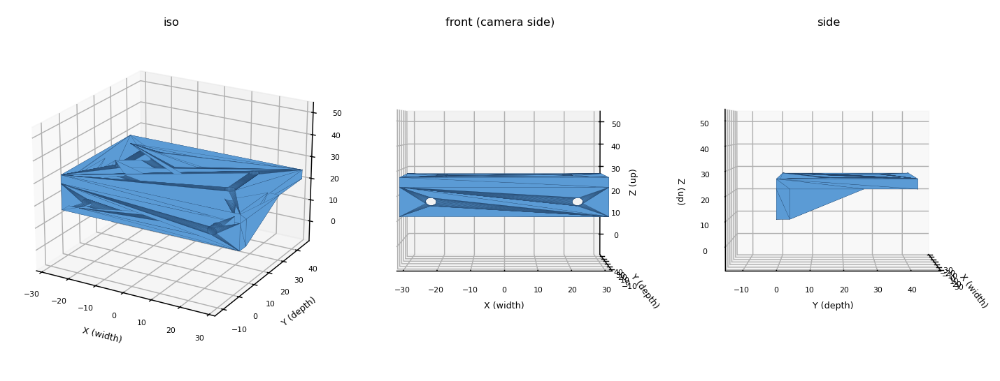

# XLeRobot → D435i printable bracket

> [!note] In-vault pointer
> The actual CAD artifacts live **outside this Obsidian vault**, in the repo's
> `hardware/` directory (a sibling of `wiki/`). Obsidian can't follow links out
> of the vault, so this stub exists to surface the bracket from inside the wiki
> and embed the preview. The files are tracked in git.

A parametric L-bracket that mounts an Intel **RealSense D435i** to the
[XLeRobot](../../entities/xlerobot.md), bolting to the camera's two front-face
**M3 holes (45 mm pitch)**. Built because the stock XLeRobot press-fit shell is
keyed to the slimmer **D415** body (99 × 20 × 23 mm) and will not accept the
**D435i** (90 × 25 × 25 mm) — full rationale in
[XLeRobot camera options for low-light + clutter](xlerobot-camera-options-low-light.md).



## Where the files are

Repo path (from the repository root, **not** the vault root):

```
hardware/xlerobot-d435i-bracket/
├── d435i_bracket.stl     # watertight, 64 × 42 × 16 mm, ~14.7 cm³ — slice-ready
├── d435i_bracket.scad    # parametric source (edit + re-export)
├── preview.png
└── README.md             # parameters, print settings, fit-check caveats
```

On GitHub, browse: [`hardware/xlerobot-d435i-bracket/`](../../../hardware/xlerobot-d435i-bracket/)
(this relative link resolves on GitHub and the local filesystem, but not inside Obsidian).

## Confirm before the final print

- **`cam_m3_z`** (M3 hole height above the camera's bottom edge) — **not** published
  in the Intel D400 datasheet; default 17 mm is an estimate. Caliper your unit or test-fit.
- **Robot-side hole pattern** — currently a placeholder; set to the actual XLeRobot
  "last mounting link" bolt pattern.

## Related

- [XLeRobot camera options for low-light + clutter](xlerobot-camera-options-low-light.md) — the parent analysis
- [XLeRobot](../../entities/xlerobot.md) — the platform
